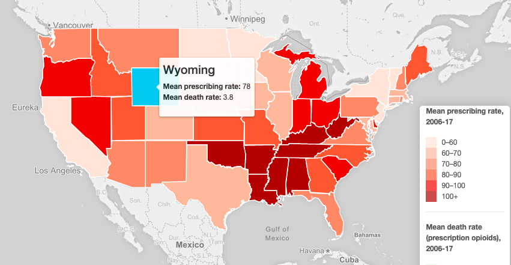
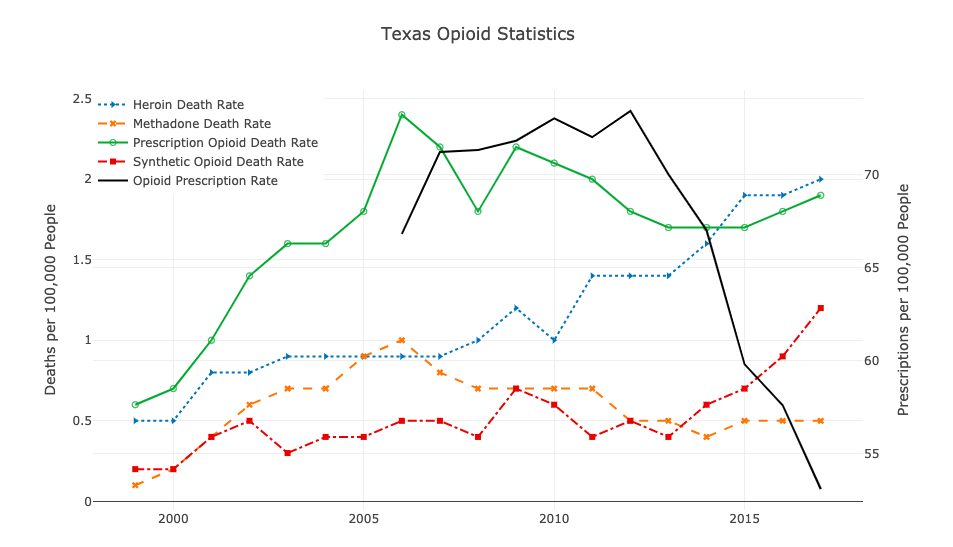

# The Avengers:
### Marshall Doig, Stephanie Engeling, Willy Goal, Robert McAlmon, Ashley McGee

## PROPOSAL:
We will be looking at prescribing rates and death rates of prescription and synthetic drugs in the United States. We will compare the death rates of prescription drugs and illegal drugs to see how they differ and which drugs result in higher death rates.

### Link to datasets:
Centers for Disease Prevention and Control WONDER database
CDC opioid prescribing rate maps (with data tables included)
CDC National Center for Health Statistics Vital Statistics online data portal

### Inspirational Screenshots:

The number of opioids prescribed, per person, by county. 

Number of drug overdoses, each end-of-month, by drug type

### Final Design Sketch:

We will use a dashboard design for our datasets which will include at least 2 interactive graphs and at least one U.S. map that will allow the user to drill down into the data and highlight the rate of death by prescription drug overdose versus the the rate of death by illegal or illicit substance.

### Link to the Github:
https://github.com/sengeling/Project2